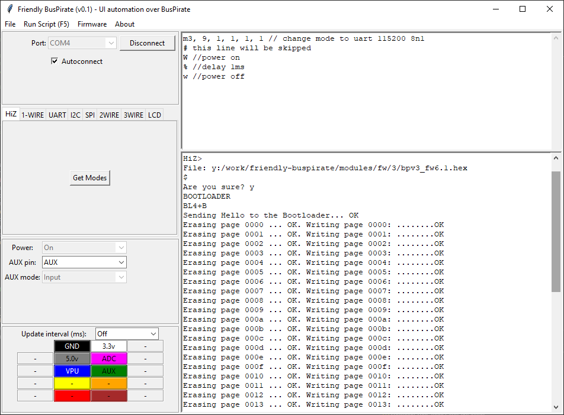

# friendly-buspirate

Friendly user interface for <a href="http://dangerousprototypes.com/docs/Bus_Pirate" target="_blank">Bus Pirate</a>

## Features

* Detect firmware available modes
* Automatically connect to the last selected port
* Reopen last edited script

## Notes

* Only tested on windows machine
